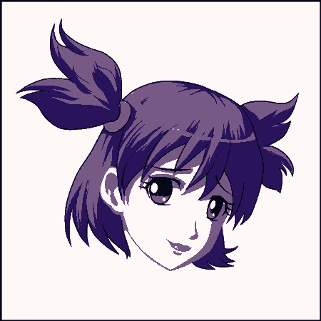
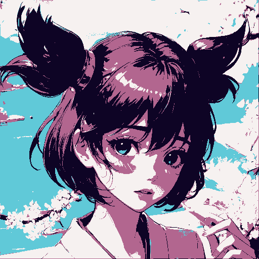
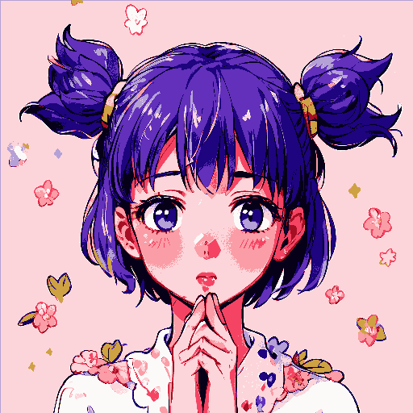
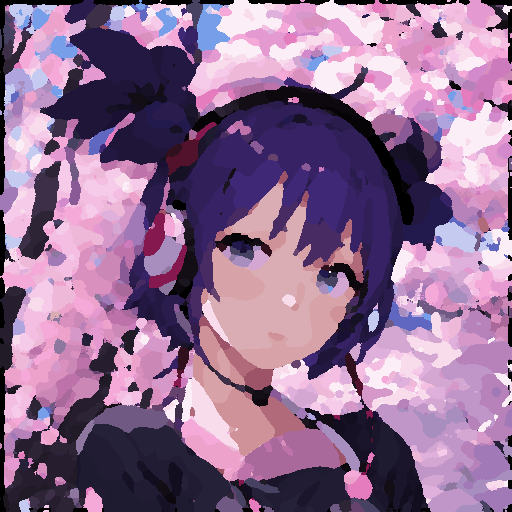
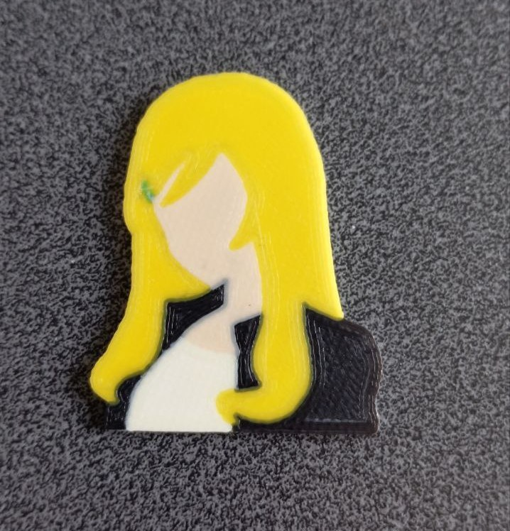

<!DOCTYPE html>
<html lang="en">
<head>
  <meta charset="UTF-8">
  <meta name="viewport" content="width=device-width, initial-scale=1.0">
</head>
<body>
  <h1>Image to STL Converter</h1>

  <h2>Description:</h2>
  
This project aims to simplify the creation of multicolor single-layer models such as pins or keychains by converting raster images into separate STL files for each color. Unlike traditional methods that involve vector drawing and CAD software, this tool streamlines the process, enabling users to skip several intermediate steps. To use it you need to have <a href="https://processing.org/">Processing IDE</a> installed.

  <h2>Functionality:</h2>
  <ol>
    <li><strong>Image Upload:</strong> Users can upload a regular raster image as input.</li>
    <li><strong>Image Processing:</strong> The application provides options to adjust size, brightness, contrast, and apply filters like edge detection, blur, or noise.</li>
    <li><strong>Quantization:</strong> The image can be quantized to reduce the number of colors, facilitating the division into different STL files.</li>
    <li><strong>Smoothing:</strong> Users can apply a smoothing filter to remove small details that may cause issues during slicing or printing.</li>
    <li><strong>Output Generation:</strong> The program saves several versions of the image, including processed by filters, quantized, quantized smoothed, and black & white images separated by color.</li>
    <li><strong>Model Customization:</strong> Users can adjust the required height of the models and the resolution/size of future models.</li>
    <li><strong>STL File Generation:</strong> Clicking on the convert button saves separate STL files for each color.</li>
  </ol>

  <h2>Instructions:</h2>
  <ol>
    <li>Upload your raster image.</li>
    <li>Adjust size, brightness, contrast, and apply filters as needed.</li>
    <li>Quantize the image to reduce colors.</li>
    <li>Apply a smoothing filter if necessary.</li>
    <li>Save the processed images.</li>
    <li>Set the required height and resolution for the models.</li>
    <li>Click on the convert button to generate separate STL files.</li>
    <li>Download the STL files for 3D printing.</li>
  </ol>

  <h2>Additional Notes:</h2>
  <ul>
    <li>The program may produce large and unoptimized STL files.</li>
    <li>Experimentation and improvement of the program are encouraged.</li>
    <li>The resulting images may have visually interesting stylized effects.</li>
    <li>The project is hosted on GitHub for further exploration and collaboration.</li>
  </ul>

  <h2>Examples of Use:</h2>
  
  
  
  
  
</body>
</html>
